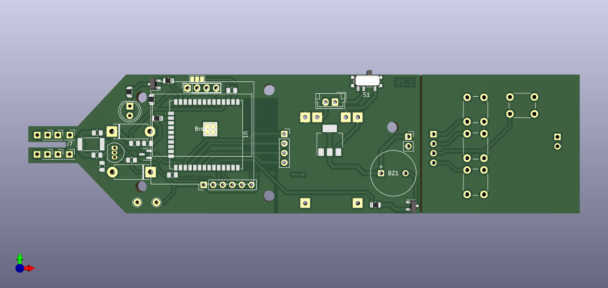

Схему можно увидеть в [carcontroltool-esp32-plan.pdf](carcontroltool-esp32-plan.pdf)

В файле carcontroltool-esp32-plan.step имеется модель для CAD, которую можно использовать для создания собственного корпуса устройства.
Платп состоит из двух частей. В файле

[carcontroltool-esp32-model-CutCarControllTool-esp32-Right.stl](cad\carcontroltool-esp32\carcontroltool-esp32-model-CutCarControllTool-esp32-Right.stl)

[carcontroltool-esp32-model-CutCarControlTool-Esp32-Left.stl](cad\carcontroltool-esp32\carcontroltool-esp32-model-CutCarControlTool-Esp32-Left.stl)

находится трехмерные модели обеих плат.

Схему можно посмотреть в файле [carcontroltool-esp32-plan.csv](carcontroltool-esp32-plan.csv)

Добавлен светодиод для подсветки. Управление должно идти через меню.
Добавлен транзистор на активацию пищалки: увы, 10мА с пина МК недостаточно управлять пищалкой. слишком тихо.
