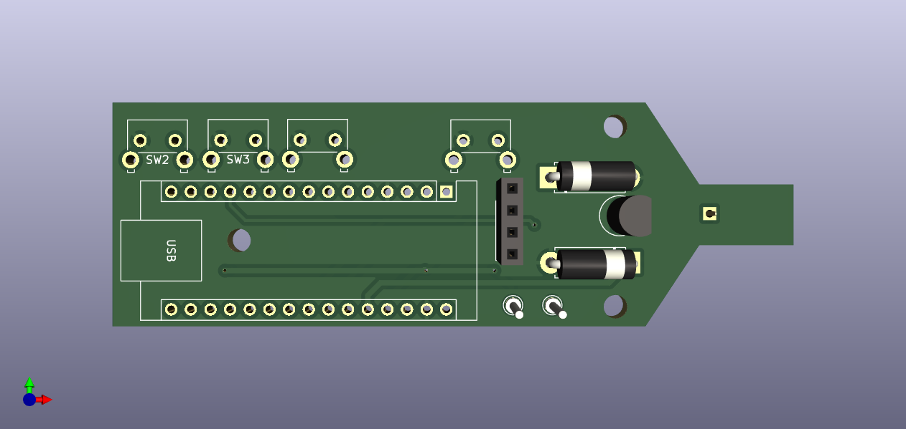
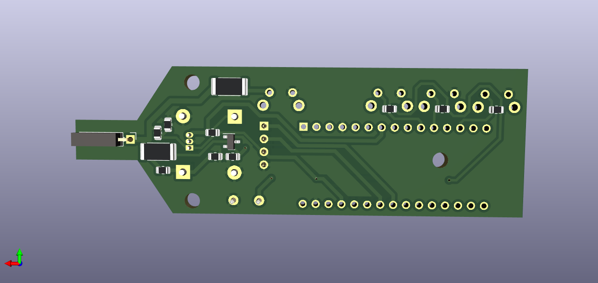

Схема разработана в KiCAD, который можно свободно установить на компьютер. .
Схема устрройства  
Список элементов платы

Снизу представлены изображения платы а так же рехмерные модели для возможности построения своего корпуса в любом удобном и доступном вам CAD.
 
 

STEP   
STL 
Используя эти файлы вы можете сами свободно разработать модель своего корпуса и заказать на любом удобнов вам сервисе 3D печати.

Питание

Питание модуля ограничено напряжением 5 вольт. Ток потребления 26mA. По своему усмотрению такие параметры могут обеспечить:
- Автомобильный адаптер, подключенный к боровой аккумуляторной батареи;
- Любой PowerBank для сотового телефона;
- 4 батареи формата AAA последовательно подклченные.
